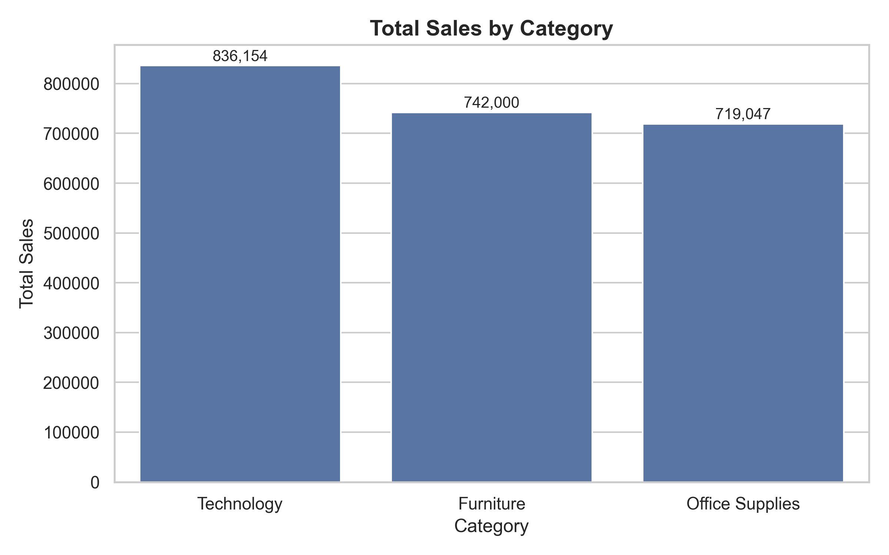
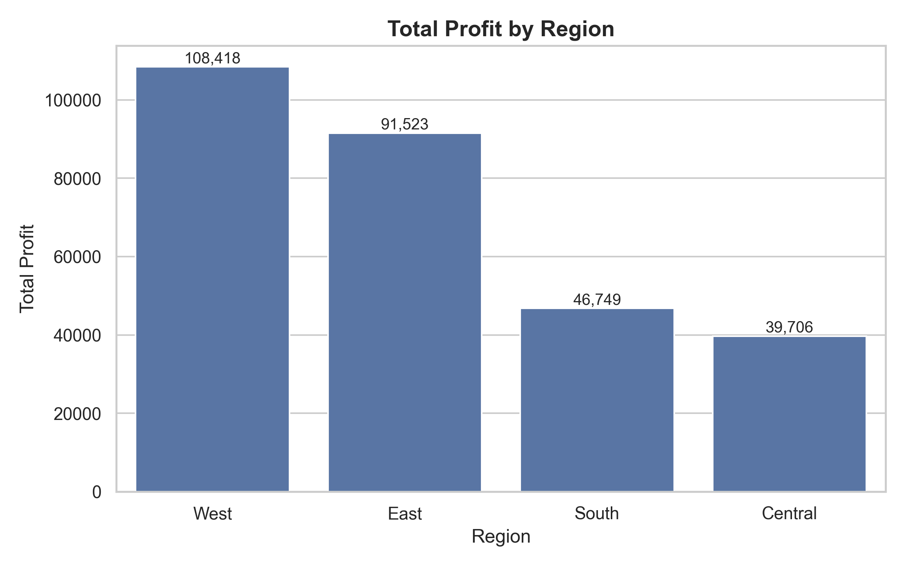
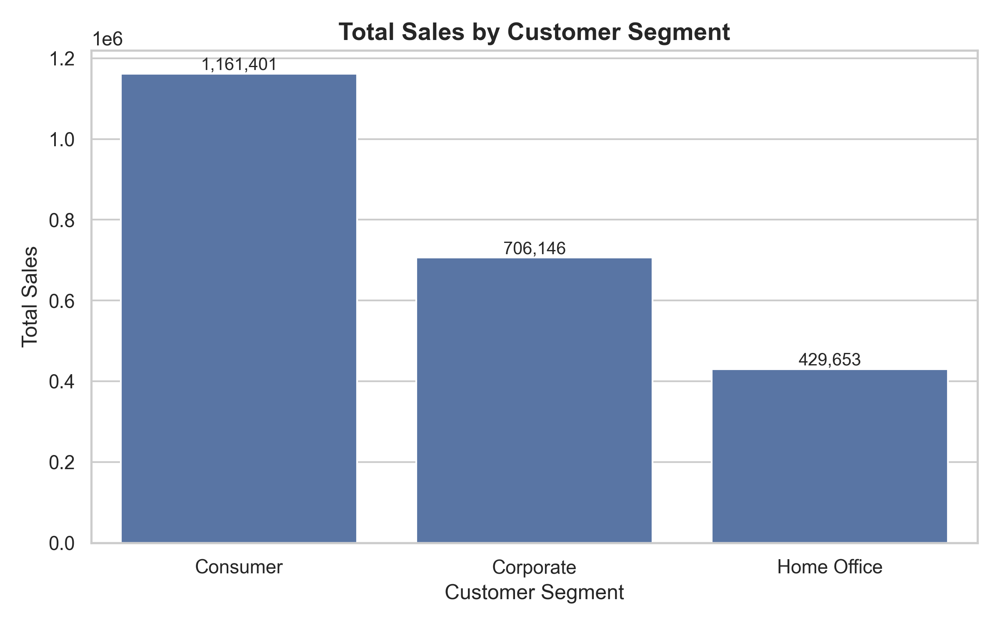
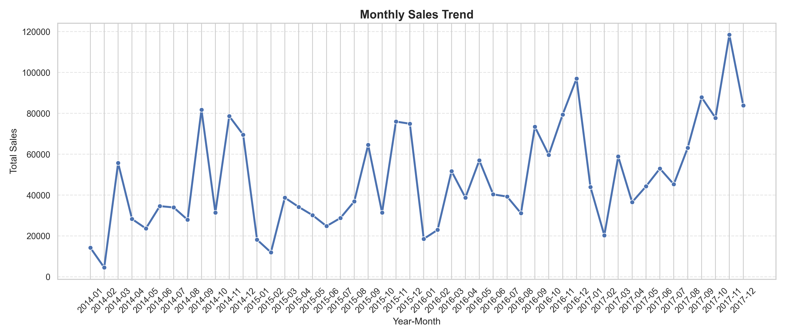
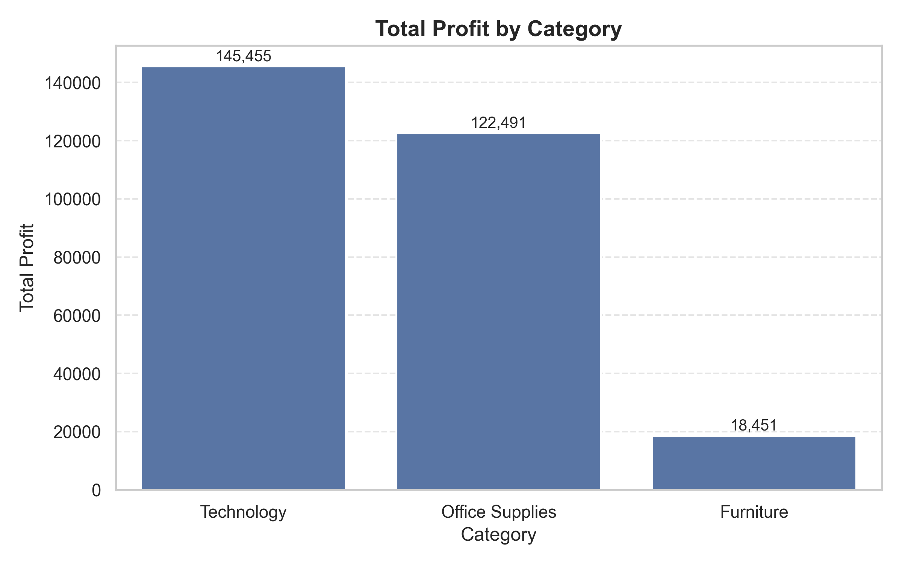
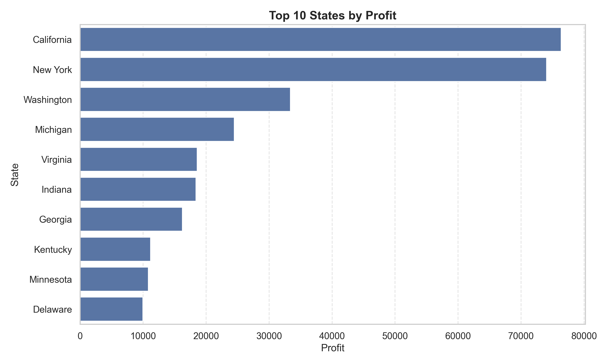
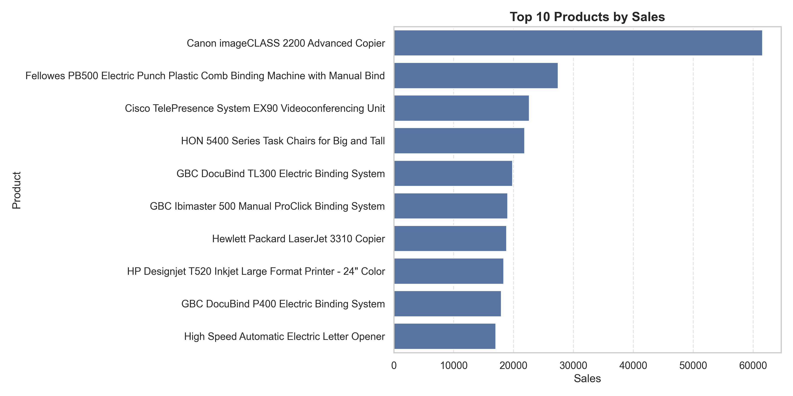
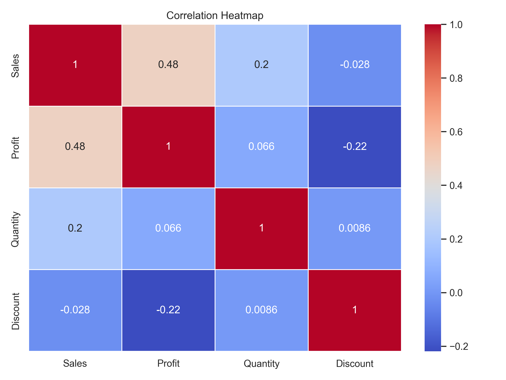

# 📊 Data Cleaning and Visualization using Python

A complete data analysis project that demonstrates **data cleaning, exploratory data analysis (EDA), and business insight generation** using the Superstore Sales Dataset. The project follows a structured data analytics workflow using Python and its popular data science libraries.

---

## 📌 Project Overview

The goal of this project is to transform raw sales data into meaningful business insights through data preprocessing and visualization.

The project includes:
- Data exploration
- Data cleaning
- Data preprocessing
- Outlier analysis
- Exploratory Data Analysis (EDA)
- Business insights
- Data visualization

---

## 🎯 Objectives

- Understand the dataset structure
- Check and handle missing values
- Identify duplicate records
- Convert data types
- Detect outliers
- Analyze sales and profit trends
- Generate business insights through visualizations

---

## 🛠️ Technologies Used

| Technology         | Purpose |
|--------------------|---------|
| Python             | Programming Language |
| Pandas             | Data Cleaning & Analysis |
| NumPy              | Numerical Operations |
| Matplotlib         | Data Visualization |
| Seaborn            | Statistical Visualization |
| Jupyter Notebook   | Development Environment |

---

## 📂 Project Structure

```text
Data-Cleaning-and-Visualization-Project/
│
├── Dataset/
│   └── Sample - Superstore.csv
│
├── Notebook/
│   └── Data_Cleaning_and_Visualization.ipynb
│
├── Images/
│   ├── sales_by_category.png
│   ├── profit_by_region.png
│   ├── sales_by_segment.png
│   ├── monthly_sales_trend.png
│   ├── profit_by_category.png
│   ├── top_states_profit.png
│   ├── top_products_sales.png
│   └── correlation_heatmap.png
│
├── README.md
├── requirements.txt
└── .gitignore
```

---

# 🧹 Data Cleaning Process

The following preprocessing steps were performed:

- ✅ Loaded the dataset using Pandas
- ✅ Explored dataset structure
- ✅ Checked missing values
- ✅ Checked duplicate records
- ✅ Converted date columns to datetime format
- ✅ Performed outlier analysis using boxplots
- ✅ Verified dataset quality before visualization

---

# 📊 Exploratory Data Analysis (EDA)

The following analyses were performed:

- 📈 Sales by Category
- 🌍 Profit by Region
- 👥 Sales by Customer Segment
- 📅 Monthly Sales Trend
- 💰 Profit by Category
- 🏆 Top 10 States by Profit
- 📦 Top 10 Products by Sales
- 🔥 Correlation Heatmap

---

# 🖼️ Project Visualizations

> *(Add screenshots after uploading your project to GitHub.)*

### Sales by Category



---

### Profit by Region



---

### Sales by Customer Segment



---

### Monthly Sales Trend



---

### Profit by Category



---

### Top 10 States by Profit



---

### Top 10 Products by Sales



---

### Correlation Heatmap



---

# 💡 Key Business Insights

- Technology generated the highest sales.
- Technology also achieved the highest overall profit.
- Consumer customers contributed the largest share of revenue.
- The West region generated the highest profit.
- California emerged as the most profitable state.
- Furniture recorded strong sales but comparatively lower profit.
- Higher discounts were associated with lower profitability.

---

# 🚀 Future Improvements

- Develop an interactive dashboard using **Power BI** or **Tableau**
- Build a **Streamlit** web application
- Apply Machine Learning models for sales forecasting
- Add interactive visualizations using **Plotly**
- Perform advanced customer segmentation

---

# ▶️ How to Run This Project

### Clone the repository

```bash
git clone https://github.com/your-username/Data-Cleaning-and-Visualization-Project.git
```

### Install the required libraries

```bash
pip install -r requirements.txt
```

### Open the notebook

```text
Notebook/Data_Cleaning_and_Visualization.ipynb
```

### Run all cells

---

# 📚 Dataset

**Dataset Used:** Superstore Sales Dataset

The dataset contains information about:
- Orders
- Customers
- Products
- Sales
- Profit
- Discount
- Shipping
- Region
- Category
- State

---

# 📌 Skills Demonstrated

- Data Cleaning
- Data Wrangling
- Exploratory Data Analysis (EDA)
- Data Visualization
- Business Analytics
- Python Programming
- Pandas
- NumPy
- Matplotlib
- Seaborn

---

# 👨‍💻 Author

**Ved Prakash**

B.Tech Computer Science (Data Science & AI)

Data Science Intern at Thiranex AI

GitHub: https://github.com/Vedprakash016

LinkedIn: https://www.linkedin.com/in/ved-prakash016/

---

## ⭐ If you found this project helpful, consider giving it a star!